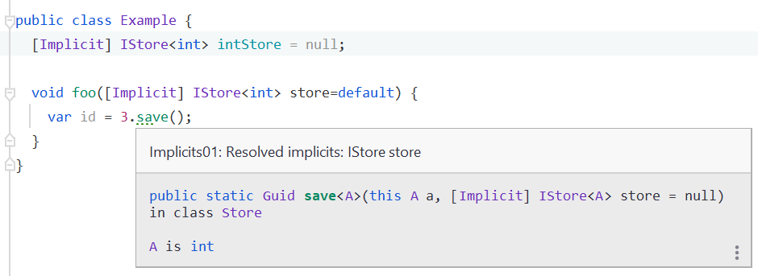

# Implicit Parameter Resolution

Implicit parameter resolution is a feature that we have ported from the [Scala language](https://scala-lang.org). They are a way to resolve function parameter values without providing them explicitly.

We currently have two ways to use implicits: `[Implicit]` and `[ImplicitPassThrough]`.

## Implicit

You can mark parameters to functions as implicits:
```cs
using GenerationAttributes;

public static A Sum<A>(
  this IEnumerable<A> elements, [Implicit] Numeric<A> numeric = default
) =>
  elements.Aggregate(numeric.Zero, (a, b) => numeric.Add(a, b));
```

When you invoke this function, you can either:
- Provide the argument explicitly, then it will behave as a regular function.
  
  ```cs
  var sum = new []{1, 2, 3}.Sum(Numeric.Integer);
  ```
- Or omit the parameter, in which case the compiler will perform an implicit search to provide a value for the parameter at a compile time.
  
  ```cs
  var sum = new []{1, 2, 3}.Sum();
  ```

### Implicit Resolution Process

The compiler tries to find a value for the implicit parameter using these rules:
- It has to find **exactly one** value of the required type. Finding zero or more than one values is a compile time error.
- The compiler first looks for any parameters marked as `[Implicit]` in the local function.

  For example:
  ```cs
  public int SumIntegers(int[] integers, [Implicit] Numeric<int> numeric = default) =>
    integers.Sum();
  ```

  Will compile to:
  ```cs
  public int SumIntegers(int[] integers, [Implicit] Numeric<int> numeric = default) =>
    integers.Sum(numeric);
  ```
- If the compiler can not find a suitable value in the local scope, it tries the class / struct scope.

  For example:
  ```cs
  class NumberCruncher {
    // This can also be static.
    readonly [Implicit] Numeric<int> IntNumeric = /* ... */;

    public int SumIntegers(int[] integers) => integers.Sum();
  }
  ```

  Will compile to:
  ```cs
  class NumberCruncher {
    readonly [Implicit] Numeric<int> IntNumeric = /* ... */;

    public int SumIntegers(int[] integers) => integers.Sum(IntNumeric);
  }
  ```
- If class / struct scope fails as well, it tries to find a `public static` field, property or method to provide the value.

  For example:
  ```cs
  public static class Numerics {
    [Implicit] public static readonly Numeric<int> IntNumeric = /* ... */;
  }

  class NumberCruncher {
    public int SumIntegers(int[] integers) => integers.Sum();
  }
  ```

  Will compile to:
  ```cs
  public static class Numerics {
    [Implicit] public static readonly Numeric<int> IntNumeric = /* ... */;
  }

  class NumberCruncher {
    public int SumIntegers(int[] integers) => integers.Sum(Numerics.IntNumeric);
  }
  ```
- If it can not find a value, a compilation error is emitted:

  `Example.cs(24, 16): [Implicits02] No matching implicits found for parameter 'numeric' of type 'Numeric<int>' on operation 'SumIntegers'`

:::note
The resolution always follows the `function`, `class / struct`, `global` order.

The idea behind it is that the more local the scope is, the more relevant the implicit value is to your computation.
:::

:::info
Implicits have to rewrite your code, thus you will end up with a `.transformed.cs` file.

See [code transformation](../../generation-and-transformation/index.md) for more information.
:::

### Implicit Hinting

If you are using an IDE that supports compiler hints, the IDE will show you a hint with the information of how the implicit was resolved without the need of recompile.



## ImplicitPassThrough

If your function itself does not use the implicit, but you just have to pass it to other invoked functions, instead of specifying the implicits manually, you can use the `[ImplitictPassThrough]` attribute.

For example, this code:
```cs
void Run2([Implicit] Numeric<int> numeric = default) {
  /* ... */
}

[ImplicitPassThrough]
void Run1() {
  Run2();
}
```

Will get transformed to:
```cs
void Run2([Implicit] Numeric<int> numeric = default) {
}

[ImplicitPassThrough]
void Run1([GenerationAttributes.Implicit] Numeric<int> _implicit_Numeric_Int32 = default) {
  Run2(numeric: _implicit_Numeric_Int32);
}
```