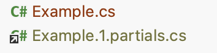
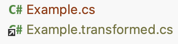

# Code Generation vs Transformation

Our compiler can do two things:
- Generate extra code to augment the compilation.
- Rewrite existing code to transform the compilation.

## Code Generation

Code generation is a process when additional code is added to the source code when compiling. These could be new classes, structs or functions. For example, [`[Record]`](../capabilities/records.md) attribute generates extra code, but does not touch existing code.

This is done by generating `*.partials.cs` files which contain:
- `partial` definitions of `class`es and `struct`s containing extra functions and types.
- standalone types, such as compiler-generated `enum`s.

:::info
The generated files are stored in `generated-by-compiler/CS_PROJECT_NAME/partials/` directory.
:::

The process looks like this:
1. Analyze the source files.
2. Generate the `.partials.cs` files.
3. Attach them to the compilation.
4. Continue compiling.

## Code Transformation

Meanwhile code transformation is a process where existing code gets rewritten. See [`[LazyProperty]`](../capabilities/lazy-property.md) for an example.

:::info
The generated files are stored in `generated-by-compiler/CS_PROJECT_NAME/macros/` directory.
:::

The process looks like this:
1. Analyze the source files.
2. Generate the `.transformed.cs` files.
3. **Replace** the source files with the `.transformed.cs` files.
4. Continue compiling.

:::caution
**Debugging transformed code**

Take note that because your source files are **not** actually included in the compilation, nothing will happen if you will put debugger breakpoints on them.

Instead you have to put the debugger breakpoints in the `.transformed.cs` files, as that is the code that actually got compiled.
:::

## Attaching the generated and transformed code to the IDE

TODO: what you need to do so that IDE would see the files.